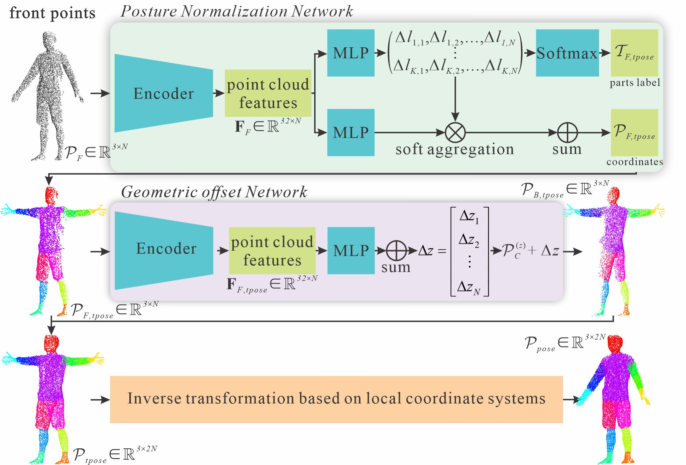

# PoseNorm-PCN

To address the issues of sensitivity to posture changes and limited detail restoration capabilities in existing point
cloud completion methods for human body data processing. We propose a human body point cloud completion network based on
pose normalization (PoseNorm-PCN). The method adopts a three-stage modeling strategy. First, the pose normalization
network maps point clouds from arbitrary poses into a normalized space. Second, the offset of the $z$ axis direction
from the front point cloud deformation to the back geometry is inferred through a single-branch geometric offset
network. Third, the back point cloud in the normalized space is mapped back to the original space based on the local
coordinate system of the corresponding front points in the normalized space and the original space. Finally, a complete
human point cloud consistent with the input pose is generated.



## Installation

```bash
# 1. Install required dependencies
pip install -r requirements.txt

# 2. Move into the project directory
cd <project_path>

# 3. Run the pipeline
python Pipeline.py --f <scan_file_path> --g <gender> --s <save_path>
``` 

## Command line arguments:

--f: Path to input scan .npz file

--g: Gender of the subject (male or female)

--s: Directory to save the results

## Example:
```bash
python Pipeline.py --f test_data/00032_longshort_ATUsquat.000001.npz --g male --s results/
``` 

## Contact
Author: Ming Li

Email: [helloming@shu.edu.cn]

## License

**Unauthorized distribution, reproduction, or usage of the source code, pretrained models, or any part of this project without explicit permission from the author is strictly prohibited.**  
Any form of plagiarism, commercial exploitation, or misrepresentation will be subject to legal consequences.

The checkpoints used in this project are **not publicly available**.  
If you need access to the pretrained checkpoints, please **contact the author** at [helloming@shu.edu.cn].

